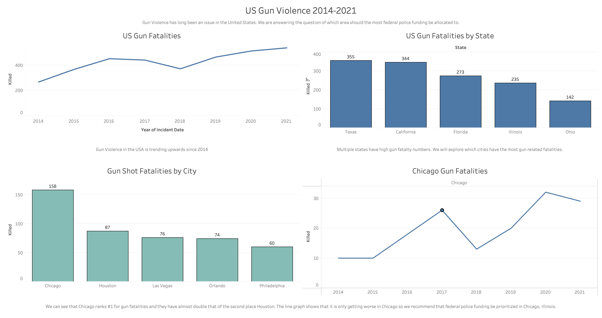

# US Gun Violence 2014-2021

This project use data from kaggle that can be found here: https://www.kaggle.com/konivat/us-gun-violence-archive-2014

The dashboard below was created using Tableau and we attempt to answer the following question.

**Which area should federal police funding be prioritized to help reduce gun fatalities.**

### From this dashboard we recommend that federal police funding be prioritized in Chicago Illinois as they are the leading city for Gun Fatalities by far in the last 7 years
